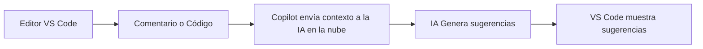

### **Módulo 1: Fundamentos de GitHub Copilot y la IA Generativa**

#### **Bienvenida**
¡Bienvenido al primer módulo! Aquí sentaremos las bases de lo que es la **Inteligencia Artificial Generativa** y cómo ha dado vida a herramientas revolucionarias como **GitHub Copilot**. El objetivo es que entiendas el "porqué" detrás de Copilot antes de sumergirnos en el "cómo".

---

#### **Actividad Inicial: Diagnóstico y Expectativas**

Antes de comenzar, responde brevemente:
- ¿Qué sabes sobre IA generativa aplicada al código?
- ¿Qué esperas aprender de Copilot?

**Quiz rápido:**
1. ¿Qué diferencia a Copilot de un autocompletado tradicional?
2. ¿Crees que Copilot puede generar código 100% seguro y libre de errores?
3. ¿Qué riesgos legales o éticos imaginas al usar IA para programar?

---

#### **¿Qué es realmente la IA Generativa?**

#### **Evolución: De Autocompletar Tradicional a IA Generativa**

Antes, los editores ofrecían autocompletado basado en palabras clave o firmas de funciones conocidas (ej: IntelliSense, snippets). Copilot representa un salto: comprende el contexto, aprende de millones de ejemplos y genera código nuevo, no solo lo completa.


**Ejemplo visual:**

<span style="font-size:0.9em;">Imagen: Comparación entre autocompletado tradicional y Copilot. El primero sugiere palabras, el segundo genera funciones completas.</span>

---

#### **¿Qué es realmente la IA Generativa?**
Imagina un artista que ha estudiado miles de pinturas para aprender a crear una obra maestra original. La IA Generativa funciona de manera similar. Utiliza **modelos de lenguaje grandes (LLMs)**, como los de la familia GPT (Generative Pre-trained Transformer), que han sido entrenados con cantidades masivas de texto y código.


Gracias a este entrenamiento, no solo "recuerdan" información, sino que aprenden patrones, sintaxis, estilos y lógica de programación. Esto les permite **generar contenido completamente nuevo y coherente** en respuesta a una instrucción (un "prompt"). En nuestro caso, el contenido es código.

#### **GitHub Copilot: Tu Compañero de Programación IA**
GitHub Copilot no es un simple autocompletado. Es un servicio sofisticado que integra el poder de los LLMs directamente en tu editor de código.


---

#### **Descubre el Error: Ejercicio de Pensamiento Crítico**

Analiza el siguiente fragmento sugerido por Copilot:

```javascript
function validarEmail(email) {
  return /.+@.+\..+/.test(email);
}
```

**¿Detectas algún problema de seguridad o mala práctica?**

Ahora, revisa este otro:

```javascript
function sumar(a, b) {
  return a + b;
}
```

¿Qué pasaría si `a` o `b` no son números?

---

#### **El Rol del Desarrollador en la Era de la IA**
*   **¿Cómo funciona?**: Copilot analiza el contexto de tu trabajo (el código que estás escribiendo, los archivos abiertos, los comentarios) y lo envía a un modelo de IA. El modelo procesa este contexto y te devuelve una o varias sugerencias de código que puedes aceptar, rechazar o modificar.

*   **Aplicaciones clave en el desarrollo**:
    *   **Creación de código**: Desde una simple línea hasta funciones y clases completas.
    *   **Resolución de problemas**: Ayuda a traducir la lógica de negocio (expresada en un comentario) a código funcional.
    *   **Aprendizaje**: Puede enseñarte nuevas librerías, sintaxis o formas de resolver un problema.
    *   **Automatización**: Reduce el tiempo que dedicas a escribir código repetitivo (boilerplate).

| Prompt Malo | Prompt Bueno |
|---|---|
| `// función para ordenar` | `// función que ordena un array de objetos por la propiedad 'edad' de menor a mayor` |
| `// sumar` | `// función que recibe dos números y devuelve su suma` |
| `// test` | `// genera pruebas unitarias para la función 'sumar' usando Jest` |
| `// refactorizar` | `// refactoriza este bucle for en un map` |
| `// documentar` | `// genera documentación JSDoc para la función 'validarEmail'` |
| `// consumir API` | `// función asíncrona que hace un fetch a la API de usuarios y devuelve el resultado en JSON` |

**Consejo:** Sé claro, específico y describe el objetivo, no solo el proceso. Prueba prompts para testing, refactorización, documentación y APIs.

---


#### **El Rol del Desarrollador en la Era de la IA**

La llegada de Copilot no reemplaza al desarrollador, sino que **evoluciona su rol**.
*   **De escritor a revisor**: Pasarás menos tiempo escribiendo código desde cero y más tiempo revisando, depurando y guiando las sugerencias de la IA. Tu pensamiento crítico y tu experiencia son más importantes que nunca.
*   **El arte del "Prompting"**: Aprender a comunicarte eficazmente con la IA a través de comentarios claros y precisos (lo que se conoce como "prompt engineering") se convierte en una habilidad fundamental.

**Justifica tu respuesta en una frase.**

**Recursos sobre licencias:**
- [choosealicense.com](https://choosealicense.com/)
- [Licencias en GitHub Docs](https://docs.github.com/es/github/creating-cloning-and-archiving-repositories/licensing-a-repository)


#### **Limitaciones y Consideraciones Éticas**
*   **No es perfecto**: Copilot puede generar código incorrecto, ineficiente o inseguro. La responsabilidad final siempre es tuya.
*   **Sesgos en el entrenamiento**: El modelo fue entrenado con código público, que puede contener errores o malas prácticas. Debes estar atento y aplicar tu criterio.
*   **Originalidad y licencias**: Copilot está diseñado para generar código nuevo. Sin embargo, es crucial entender las políticas de tu empresa sobre el uso de herramientas de IA y la propiedad intelectual del código generado.


---


#### **Ejemplo Práctico: De Prompt a Código**

<span style="font-size:0.9em;">Diagrama de flujo accesible: desde el editor, el contexto viaja a la IA y vuelve como sugerencia.</span>


Supón que escribes el siguiente comentario en tu editor:

```javascript

// Función que recibe un array de números y devuelve el promedio

Copilot sugerirá automáticamente:
  return arr.reduce((a, b) => a + b, 0) / arr.length;
}
**Ejercicio:**
1. Prueba con un prompt vago: `// función para procesar datos` y observa el resultado.

---

| Prompt Malo | Prompt Bueno |
|---|---|
| `// función para ordenar` | `// función que ordena un array de objetos por la propiedad 'edad' de menor a mayor` |
| `// sumar` | `// función que recibe dos números y devuelve su suma` |

**Consejo:** Sé claro, específico y describe el objetivo, no solo el proceso.

---

#### **Visualización: ¿Cómo funciona Copilot?**




---

#### **Limitaciones, Sesgos y Originalidad: Ejemplos y Reflexión**

*Ejemplo de sesgo:* Si pides `// función para validar email`, Copilot podría sugerir una expresión regular simple, pero no necesariamente la más robusta o segura.

*Ejemplo de mala práctica:* Un prompt como `// función para sumar dos números` podría sugerir una función sin validación de tipos.

**Reflexiona:**
- ¿Cómo identificarías código potencialmente inseguro generado por Copilot?
- ¿Qué harías si Copilot sugiere una función que usa una API obsoleta?

**Mini-caso ético:**
> Copilot genera una función que parece copiada de un repositorio público con licencia restrictiva. ¿Deberías usarla tal cual?

---


---

#### **Seguridad, Sesgos, Ética y Vibe Coding con GitHub Copilot**

##### Seguridad con IA y GitHub Copilot
- **Validación y revisión:** Nunca aceptes sugerencias de Copilot sin revisarlas. El código generado puede tener vulnerabilidades, como falta de validación de entradas, exposición de datos sensibles o uso de funciones obsoletas.
- **Buenas prácticas:** Aplica siempre las mejores prácticas de seguridad del lenguaje y del framework que uses. Usa linters, pruebas y revisiones de código.
- **Dependencias:** Si Copilot sugiere el uso de librerías externas, verifica su reputación, licenciamiento y si tienen vulnerabilidades conocidas.
- **Datos sensibles:** No uses Copilot para generar o manipular directamente contraseñas, claves privadas o información confidencial sin controles adicionales.
- **Actualización:** Mantén tus dependencias y herramientas actualizadas para evitar exploits conocidos.

##### ¿Qué son los sesgos y la ética en IA? ¿Cómo aplica a Copilot?
- **Sesgos:** Los modelos de IA como Copilot se entrenan con grandes volúmenes de código público. Si el código de entrenamiento tiene errores, malas prácticas o refleja prejuicios (por ejemplo, en nombres de variables, comentarios o ejemplos), Copilot puede replicar esos sesgos en sus sugerencias.
- **Ética:** Usar IA de forma ética implica:
    - No aceptar código sin entenderlo ni revisarlo.
    - Respetar licencias y propiedad intelectual: Copilot puede sugerir fragmentos similares a código bajo licencias restrictivas.
    - Ser transparente sobre el uso de IA en proyectos colaborativos.
    - No usar la IA para propósitos maliciosos o para evadir controles de seguridad.
- **Responsabilidad:** El desarrollador es siempre responsable del código que integra, aunque lo haya sugerido una IA.

##### Vibe Coding: ¿Qué es y cómo se relaciona con Copilot?
- **Vibe coding** es una tendencia donde el desarrollador busca un flujo de trabajo más fluido, creativo y menos rígido, a menudo acompañado de música, ambientes relajados y herramientas que potencian la inspiración.
- **Con Copilot:**
    - Puedes experimentar prompts más libres y creativos, dejando que la IA proponga soluciones inesperadas.
    - El "vibe coding" fomenta la exploración: prueba prompts en diferentes estilos, idiomas o niveles de detalle y observa cómo cambia la respuesta de Copilot.
    - No hay un único patrón, pero sí buenas prácticas: alterna entre prompts muy específicos y otros más abiertos para descubrir nuevas formas de resolver problemas.
- **Recomendación:** Usa el "vibe coding" como una herramienta para desbloquear la creatividad, pero siempre valida y refina el código generado antes de integrarlo a tu proyecto.

---

#### **Rol Activo del Desarrollador: Pensamiento Crítico y Responsabilidad**

* No aceptes sugerencias sin validar.
* Compara siempre con la documentación oficial.
* Usa linters y pruebas para verificar el código generado.

**Actividad sugerida:**
Debate en grupo: ¿Cómo ha cambiado tu rol como desarrollador con la llegada de la IA? ¿Qué nuevas responsabilidades tienes?

---

#### **Recapitulación y Recursos Adicionales**

**Recursos oficiales:**
- [Documentación oficial de GitHub Copilot](https://docs.github.com/en/copilot)
- [Guía de buenas prácticas de prompts](https://docs.github.com/en/copilot/using-github-copilot/getting-great-results-with-github-copilot)
- [Preguntas frecuentes sobre Copilot](https://docs.github.com/en/copilot/getting-started-with-github-copilot/about-github-copilot)

**Videos y artículos recomendados:**
- [Video: ¿Qué es GitHub Copilot? (YouTube)](https://www.youtube.com/watch?v=SGUCcjHTmGY)
- [Artículo: Cómo escribir mejores prompts para Copilot](https://github.blog/2023-03-21-getting-great-results-with-github-copilot/)

**Podcasts y webinars:**
- [Podcast: The Changelog – Copilot y el futuro del desarrollo](https://changelog.com/podcast/451)
- [Webinar: Ética y responsabilidad en la IA generativa](https://www.youtube.com/watch?v=2hX9eZ2bWcA)

Al final de este módulo, tendrás una comprensión sólida de la tecnología que impulsa a Copilot, cómo interactuar con ella de forma responsable y cómo obtener el máximo valor desde el primer día.


---

## Respuestas a actividades y ejercicios

### Actividad Inicial: Diagnóstico y Expectativas
- **¿Qué sabes sobre IA generativa aplicada al código?**
  - Respuesta sugerida: La IA generativa aplicada al código utiliza modelos avanzados (como GPT) entrenados con grandes volúmenes de código para generar funciones, sugerencias y soluciones automáticas a partir de descripciones o contexto, facilitando y acelerando el desarrollo de software.
- **¿Qué esperas aprender de Copilot?**
  - Respuesta sugerida: Espero aprender a usar Copilot para mejorar mi productividad, escribir código de mejor calidad, automatizar tareas repetitivas y entender cómo interactuar de forma efectiva con herramientas de IA en el desarrollo.

### Quiz rápido
1. **¿Qué diferencia a Copilot de un autocompletado tradicional?**
   - Copilot comprende el contexto y genera código nuevo basado en IA, mientras que el autocompletado tradicional solo sugiere palabras clave o fragmentos predefinidos.
2. **¿Crees que Copilot puede generar código 100% seguro y libre de errores?**
   - No, Copilot puede cometer errores, generar código inseguro o ineficiente; siempre requiere revisión humana.
3. **¿Qué riesgos legales o éticos imaginas al usar IA para programar?**
   - Posible uso de código con licencias incompatibles, generación de código inseguro, sesgos, y falta de atribución.

### Descubre el Error: Ejercicio de Pensamiento Crítico
**¿Detectas algún problema de seguridad o mala práctica?**
  - Sí, la expresión regular utilizada en la función `validarEmail` es demasiado permisiva y acepta muchos emails inválidos; además, no previene ataques como inyección ni valida correctamente el formato. Es una mala práctica confiar solo en una regex simple para validar emails.

**¿Qué pasaría si `a` o `b` no son números en la función sumar?**
  - Si `a` o `b` no son números, el resultado puede ser inesperado: por ejemplo, si son strings, se concatenarán en vez de sumarse numéricamente. Falta validación de tipos, lo que puede causar bugs o vulnerabilidades.
### **Módulo 1: Fundamentos de GitHub Copilot y la IA Generativa**

#### **Bienvenida**
¡Bienvenido al primer módulo! Aquí sentaremos las bases de lo que es la **Inteligencia Artificial Generativa** y cómo ha dado vida a herramientas revolucionarias como **GitHub Copilot**. El objetivo es que entiendas el "porqué" detrás de Copilot antes de sumergirnos en el "cómo".

